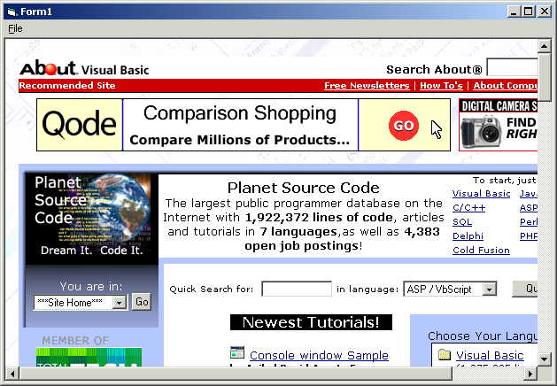



## Dynamically Add WebBrowser Control at runtime without a Reference

### Description

Allows VB applications to determine at run-time if Internet Explorer (4.0 or later) is installed, and if so, creates a WebBrowser. If not, a trappable error allows program to continue.
 
### More Info
 

             |
---                |---
**Submitted On**   |
**By**             |[Dave Slinn](https://github.com/Planet-Source-Code/PSCIndex/blob/master/ByAuthor/dave-slinn.md)
**Level**          |Beginner
**User Rating**    |5.0 (40 globes from 8 users)
**Compatibility**  |VB 6\.0
**Category**       |[Internet/ HTML](https://github.com/Planet-Source-Code/PSCIndex/blob/master/ByCategory/internet-html__1-34.md)
**World**          |[Visual Basic](https://github.com/Planet-Source-Code/PSCIndex/blob/master/ByWorld/visual-basic.md)
**Archive File**   |

### Source Code

Add a menu item named 'mnuCreate' with a caption of "&Create
WebBrowser"

Place the following code into a standard VB 6.0 form.

 
Private m_WebControl  As VBControlExtender 
 
Private Sub Form_Resize() 
On Error Resume Next 
    ' resize webbrowser to entire size of form 
    m_WebControl.Move 0, 0, ScaleWidth, ScaleHeight 
End Sub 
 
Private Sub mnuCreate_Click() 
On Error GoTo ErrHandler 
 
    ' attempting to add WebBrowser here ('Shell.Explorer.2' is registered 
    ' with Windows if a recent (>= 4.0) version of Internet Explorer is installed 
    Set m_WebControl = Controls.Add("Shell.Explorer.2", "webctl", Me) 
 
    ' if we got to here, there was no problem creating the WebBrowser 
    ' so we should size it properly and ensure it's visible 
    m_WebControl.Move 0, 0, ScaleWidth, ScaleHeight 
    m_WebControl.Visible =  True 
 
    ' use the Navigate method of the WebBrowser control to open a 
    ' web page 
    m_WebControl.object.navigate "http://www.planet-source-code.com" 
 
    Exit Sub 
ErrHandler: 
    MsgBox "Could not create WebBrowser control", vbInformation 
End Sub 

